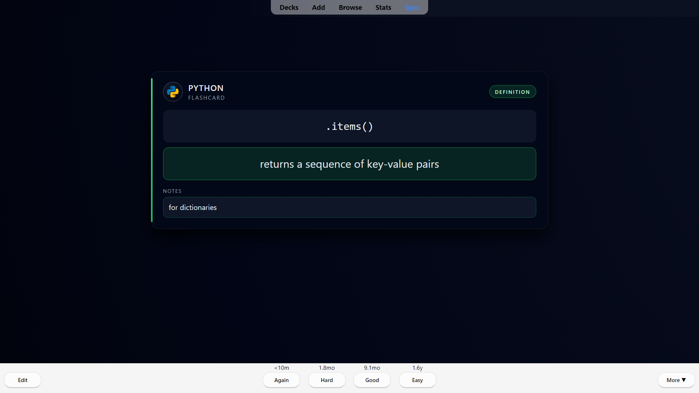

# 🧠 Modern Anki Card Templates

A curated collection of custom Anki templates created to support long-term learning and memory across technical and language disciplines. Templates work seamlessly across **desktop, AnkiWeb, and AnkiDroid (Android)**

---

## 📂 Folder Overview

| Folder                    | Description                                                         |
| ------------------------- | ------------------------------------------------------------------- |
| `it-learning/hacking/`    | Cards related to cybersecurity, ethical hacking & tools             |
| `it-learning/vim/`        | Keybindings, navigation, and editing efficiency in VIM              |
| `languages/vocabularium/` | Vocabulary cards for **Spanish**, **Italian**, **Portuguese**, etc. |
| `languages/vocabulary/`   | Cards for learning and reviewing **English vocabulary**             |
| `programming/bash/`       | Shell scripting, navigation, and CLI command recall                 |
| `programming/java/`       | Java syntax, OOP concepts, and API usage                            |
| `programming/powershell/` | Windows automation and scripting using PowerShell                   |
| `programming/python/`     | Python fundamentals, built-ins, syntax, and tips                    |

---

## 🎯 Purpose

This repository was built to consolidate and reuse Anki templates for:

- Memorizing commands, syntax, or concepts in **IT, Linux, and programming**
- Learning and reinforcing vocabulary in **English and Romance languages**
- Practicing terminal skills like **VIM navigation** or **bash scripting**
- Tracking technical career knowledge using **clean, minimalist card designs**

---

## 📸 Template Preview

### Python Template (`anki-templates/programming/python`)

---

## 🛠 How to Use

1. Open **Anki**
2. Go to `Tools > Manage Note Types > Add`
3. Choose "Add: Basic"
4. Select the newly created "Basic" note type (you can rename it)
5. Click "Cards" to open the card editor
6. Copy and paste the HTML/CSS from the desired template file into:
   - **Front Template**
   - **Back Template**
   - **Styling**
7. Save your note type and assign to your deck
8. Optional: Customize the fields and styling to match your preferences

---

## 📜 License

All templates are shared under the [MIT License](LICENSE) – feel free to adapt and reuse.

---

## 🧑‍💻 Author

Passionate about lifelong learning, cibersecurity, and self-hosted tools.
